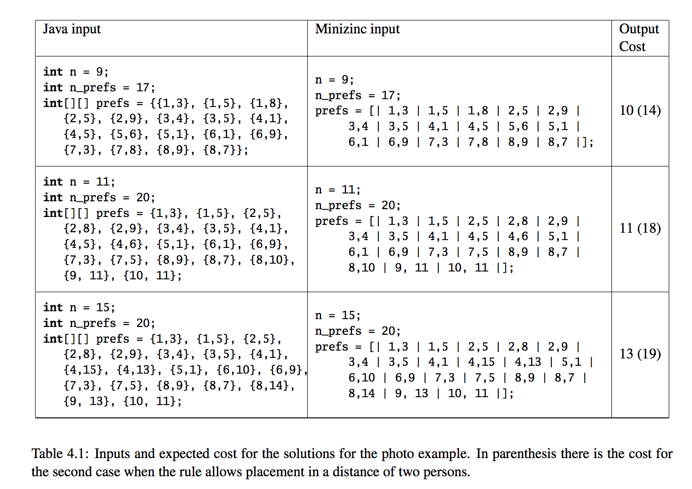

# Lab assignment – Photo

A group of n people wants to take a group photo. Each person can give preferences next to whom he or she
wants to be placed on the photo. The problem to be solved is to find a placement that satisfies maximum number
of preferences.
You should solve the original problem stated above and the modified problem that extends the rule for placement
of people. In this extension we consider that the rule is not violated if two persons are placed at maximally
two positions distance. Compare the solutions.
The program in Java or minizinc should work on different data, i.e. there is only one program that can be run
on different input data.

