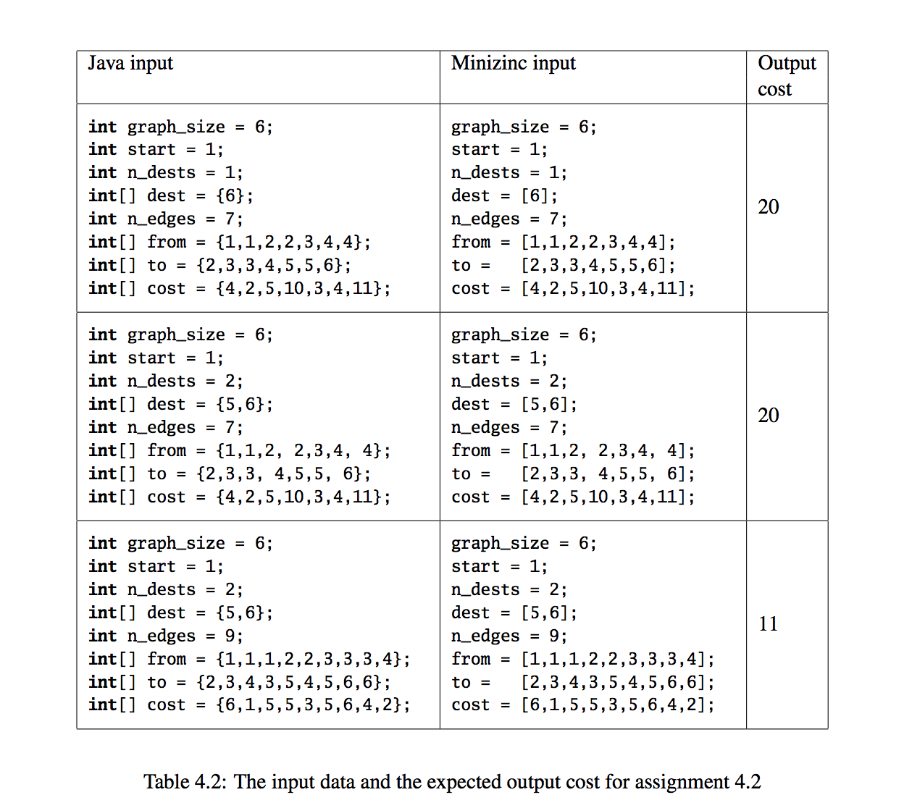

# Lab assignment – Logistics

John is a truck driver. He needs to deliver a truckload of packages to different destination cities. In each city
other truck drivers can help transport part of the packages with their trucks. So nobody is required to solve the
traveling salesman problem. Also, no driver is required to return to his starting city. Nevertheless, John has to
pay for the distances the trucks travel, and he wants to find routes for himself and the helpers such that the total
travel distance is minimized.
The problem can be formulated as a graph problem as follows: Given an undirected weighted graph, a starting
vertex, and a set of destination vertices, find a subgraph of the graph that has the minimum cost and covers the
starting vertex and all of the destination vertices.
For example consider figure 4.1, for graph (a) shown below, assume the starting vertex is 1, and the set of
destination vertices is 5,6, then graph (b) shows a minimum covering tree. The total distance in this example is
1 + 6 + 4 = 11
Table 4.2 specifies three possible inputs that you should use for the problem. It also contains for your convenience
the expect cost of the solution. There are defined the following constants.
An input specifies the size of the graph (graph_size), the starting vertex (start), the number of destinations
(n_dests), an array of destination vertices (dest), the number of edges (n_edges), and three arrays that define
the edge relation (from, to, and cost).

