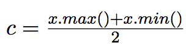

# Lab assignment – Depth First Search

File SimpleDFS.java contains a simple but fully functional depth first search (DFS). It implements basic functionality of DFS and Branch-and-Bound for minimization. The program is very simple since it makes it possible to select variables based on the order defined by the variable vector and it always assigns a minimal value to each variable.
You can try the search on the included example, Golomb.java. It is minimization example and it is described,for example in http://mathworld.wolfram.com/GolombRuler.html.
In this assignment you have to change the behavior of this search. You have to implement a split search that selects a variable based on input order, as it is done in SimpleDFS but then narrows the domain of the variable without assigning a single value to the selected variable.
Two search strategies has to be implemented.

1. The first search makes the following choice point on selected variable x.
* first choice x ≤ c, and if this fails
* second choice x > c, that is negated x ≤ c.

Where c is a middle point of the domain interval, that is .

2. The second search makes a different choice point on selected variable x.
* first choice x ≥ c, and if this fails
* second choice x < c, that is negated x ≥ c.

Where c is a middle point of the domain interval, that is .

Finally, experiment with different variable selection methods and select the best method for this example.
Test your solution on the included example and report the following statistics for the search (requires some code in the search).
* total number of search nodes, and
* number of wrong decisions
Report your results in table 4.3.

*Hint:*
Program SimpleDFS has variable trace. Setting this variable to true forces the search to output current search
variables every time the search enters a new search node. It might help you to find errors in your implementation.
