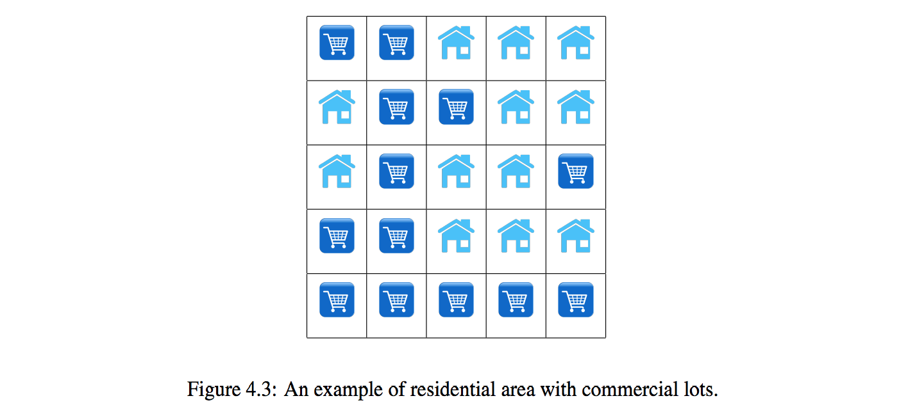
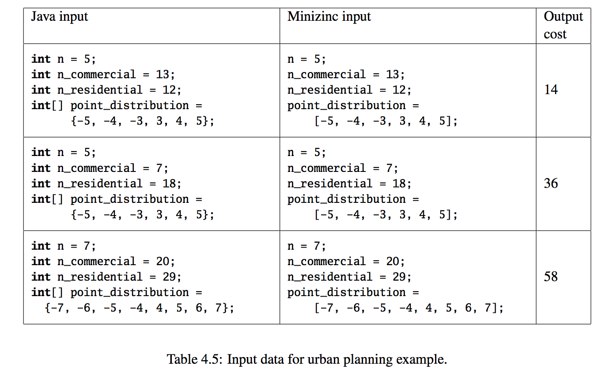

# Lab assignment – Urban Planning

Urban planning requires careful placement and distribution of commercial and residential lots. Too many
commercial lots in one area leave no room for residential shoppers. Conversely, too many residential lots in one
area leave no room for shops or restaurants.

The 5x5 grid in depicted in Figure 4.3 shows a sample configuration of residential and commercial lots. Your job is to reorder the 12 residential lots and 13 commercial lots to maximize the quality of the layout.
The quality of the layout is determined by a points system. Points are awarded as follows:

* Any column or row that has 5 Residential lots = +5 points
* Any column or row that has 4 Residential lots = +4 points
* Any column or row that has 3 Residential lots = +3 points
* Any column or row that has 5 Commercial lots = -5 points
* Any column or row that has 4 Commercial lots = -4 points
* Any column or row that has 3 Commercial lots = -3 points

For example, the layout displayed in Figure 1 has a total of 9 points: Points for each column, from left to
right = -3, -5, +3, +4, +3 Points for each row, from top to bottom = +3, +3, +3, +3, -5.

Solve this problem for input data specified in Table 4.5.
Question: What is the maximum number of points you can achieve for the layout? Give the layout for this
case.
Hint: The problem contains many equivalent symmetrical solution and to make it efficient you need to add
symmetry breaking constraints.
